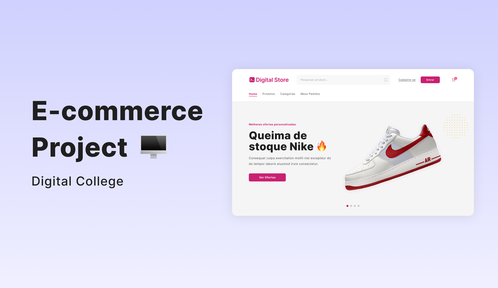

<h1 align="center">
    
</h1>

<h1 align="center">
  <a href="#"> DripStore </a>
</h1>

<!-- <h3 align="center">We help you build your project in React!</h3> -->

<p align="center">

  <!-- Número de estrelas no seu repo DigitalStore -->
  
  
  <!-- Último commit no seu repo -->
  <a href="https://github.com/EduardoLopes085/DigitalStore">
    
  </a>
    
  <!-- Licença -->
  

  <!-- Autor -->
  <a href="https://github.com/EduardoLopes085">
    
  </a>
</p>

<h4 align="center"> 
	 Status: Working...
</h4>

<p align="center">
 <a href="#sobre">Sobre</a> •
 <a href="#FUNCIONALIDADES">Funcionalidades</a> •
 <a href="Funcionamento">Funcionamento</a> • 
 <a href="#tech-stack">Tech Stack</a> •  
 <a href="#author">Author</a> • 
 <a href="#user-content-license">License</a>
</p>

## SOBRE

**DRIPSTORE** é uma aplicação frontend desenvolvida em **React** que simula um e-commerce de roupas streetwear.  
O objetivo do projeto é praticar conceitos de **componentização, gerenciamento de estado, rotas e consumo de APIs** dentro de uma aplicação moderna.


---

## FUNCIONALIDADES

- [ ] Listagem de produtos por categorias ⚡ **Loading...** → Funcionalidades em desenvolvimento  
- [ ] Página de detalhes do produto ⚡ **Loading...** → Funcionalidades em desenvolvimento  
- [ ] Carrinho de compras ⚡ **Loading...** → Funcionalidades em desenvolvimento
- [ ] Autenticação de usuário ⚡ **Loading...** → Funcionalidades em desenvolvimento 
- [ ] Integração com API de pagamentos ⚡ **Loading...** → Funcionalidades em desenvolvimento

---

## Funcionamento

Este repositório contém apenas a parte **Frontend**.

1. Frontend 
2. Backend - outro repositório 

### REQUISITOS

Antes de começar, você precisará ter instalado em sua máquina:  
- [Git](https://git-scm.com)  
- [Node.js](https://nodejs.org/en/)  
- [NPM](https://www.npmjs.com/)  

Um editor como o [VSCode](https://code.visualstudio.com/) também é recomendado.

### ▶️ Rodando o projeto (Frontend)

```bash

# Clone este repositório
$ git clone https://github.com/EduardoLopes085/DigitalStore.git

# Acesse a pasta do projeto
$ cd digitalstore

# Instale as dependências
$ npm install

# Inicie a aplicação
$ npm run dev

# O app estará rodando em http://localhost:5137

```

---

## Tech Stack

As seguintes ferramentas foram utilizadas na construção do projeto:

#### **Platform**
- **[React](https://reactjs.org/)** → Biblioteca principal
- **[Vite](https://vitejs.dev/)** → Bundler e ferramenta de build
- **[JavaScript](https://developer.mozilla.org/pt-BR/docs/Web/JavaScript)**
- **[React Router Dom](https://reactrouter.com/)** → Navegação entre páginas
- ⚡ **Loading...** → Funcionalidades futuras em desenvolvimento

> Confira todas as dependências em [package.json](https://github.com/EduardoLopes085/DigitalStore/blob/main/package.json)

#### **Utils**
- **[Visual Studio Code](https://code.visualstudio.com/)** → Editor de código
- **[Font Awesome](https://fontawesome.com/)** → Ícones prontos para uso
- **[Inter](https://fonts.google.com/specimen/Inter)** → Tipografia do projeto
---

## Author

<a href="https://www.linkedin.com/in/eduardolopesdev/">
 
 <br />
 <p><b>Eduardo Lopes</b></p></a>

[](https://www.linkedin.com/in/eduardolopesdev/)

---

## License

This project is under the license [MIT](./LICENSE).

Made with hard work and dedication by Eduardo Lopes 🥷 [Get in Touch!](https://www.linkedin.com/in/eduardolopesdev/)

---

